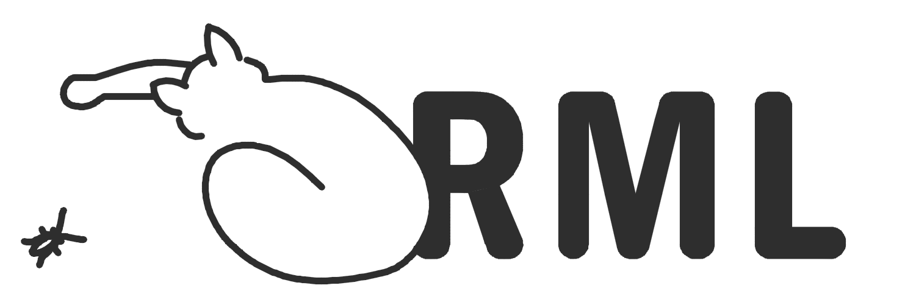

# Welcome to the Runtime Monitoring Language!

* * *



## A brief introduction
**RML** is a rewriting-based and system agnostic **Domain Specific Language** for **Runtime Verification**,
which decouples monitoring from instrumentation by allowing users to write specifications and
to synthesize monitors from them, independently of the **System Under Scrutiny** and its instrumentation. 

**RML** is more expressive than **Context-Free** grammars, for instance the following specification allows
monitoring of **FIFO** properties:

```js
// FIFO queues

enq(val) matches {event:'func_pre',name:'enqueue',args:[val]};
deq(val) matches  {event:'func_post',name:'dequeue',res:val};
deq matches deq(_);

Main = {let val; enq(val) ((deq | Main) /\ (deq >> deq(val) all))}!;
```

### Events
**RML** is based on a general model where events are represented by object literals, with
the standard **JavaScript** syntax. Consequently, monitors generated from
**RML** specifications process events with the universal data-interchange format **JSON**.

Specific event models can be conceived, depending on the kinds of properties events can have.
For instance, the specification of **FIFO** queues above is based on a simple model consisting of the
following properties keys:
- `event`, specifying two possible kinds of events: 'func_pre' and 'func_post', corresponding,
respectively to *function calls* and *returns from functions*;
-  `name`, specifying the name of the corresponding function;
-  `args`, specifying the array of the arguments passed to the function;
-  `res`, specifying the returned value, if `event` is associated with 'func_post'.

As an example, the following objects

```js
{event:'func_pre',name:'enqueue',args:[val]}
{event:'func_post',name:'dequeue',args:[],res:val}
```
specify the following events, respectively:
- function `enqueue` has been called with argument `val`;
- function `dequeue` has been called with no arguments, and returned value `val`.


